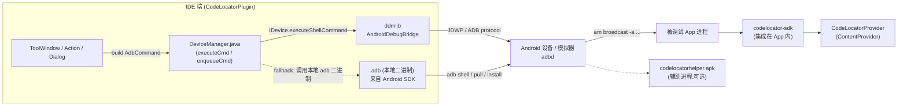
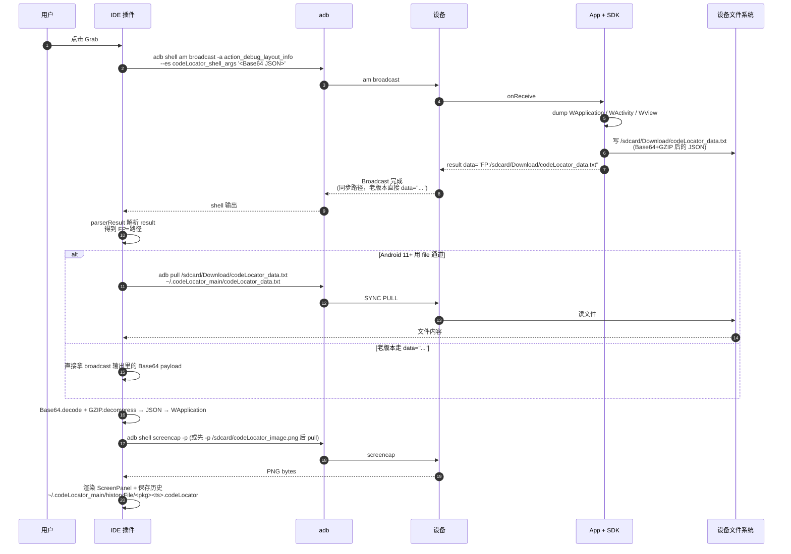

# 02 · 整体架构与通信模型

## 1. 三方角色



| 角色 | 物理位置 | 主要职责 | 本任务调研重点 |
|------|---------|---------|--------------|
| **IDE 插件** | 用户机 | 触发命令、解析返回数据、绘 UI、跳代码 | ✅ |
| **adb / ddmlib** | 用户机 | 把 shell / pull / push / install 命令送到设备 | ✅ |
| **Android 设备** | 真机或模拟器 | 执行 shell、转发广播 | ✅ |
| **被调试 App + codelocator-sdk** | 设备 | 接收广播 → dump View 树 / 改 View / 拉文件 → 写文件返回 | 反推为主，不在本仓库 |
| **CodeLocatorProvider** | App 内 | 在 `parserResult` 找不到 broadcast 返回时，作为兜底通道（异步广播结果回查、获取 SDK 是否就绪） | ✅ |
| **codelocatorhelper.apk** | 设备另外一个 APK | 跨进程剪贴板（绕过 Android 10+ 的剪贴板限制） | 调研用 |

> 通信全程**没有 HTTP 服务**。所有 IDE ↔ App 的数据都走：`adb shell am broadcast` 下发 → SDK 写文件 → `adb pull / cat` 拉回。

## 2. 三种命令通道

`DeviceManager.executeCommandInternal` (`device/DeviceManager.java:553-635`) 按 `AdbCommand` 内的 `AdbAction` 列表顺序执行，根据 action 类型走不同通道：

| 通道 | 对应 `AdbAction` 子类 | 实现 | 备注 |
|------|----------------------|------|------|
| **shell 通道**（ddmlib `executeShellCommand` 或 `adb -s xxx shell`） | `BroadcastAction`、`AdbAction(ACTION.AM/SETTINGS/PM/CONTENT/GETPROP/SETPROP/MONKEY/DUMPSYS/UIAUTOMATOR/WM/RUN_AS)` 等 | `executeShellCommand` | 受 `bytes>9900 || !useDefaultAdb` 决定走 ddmlib 还是本地 adb |
| **特殊设备协议** | `ScreencapAction(-p)`、`PullFileAction`、`PushFileAction`、`InstallApkFileAction(install)`、`UnInstallApkAction(uninstall)` | 直接走 ddmlib API 或本地 `adb pull/push/install`，**不走 shell** | `AdbCommand.ACTION.DEVICE_NOT_SUPPORT_ACTIONS` 列表里的命令走这里 |
| **dumpsys / content query 兜底** | `GetCurrentPkgNameAction(dumpsys activity activities)`、`QueryContentAction(content query --uri content://...)` | shell 通道 | 用来在 SDK 未集成或异步广播未返回时拿到包名/Activity 名/异步结果文件路径 |

切换"用本地 adb"还是"用 ddmlib"由 `CodeLocatorUserConfig.isUseDefaultAdb()` 决定。`EOF` 错误后会 `setUseDefaultAdb(false)`（`ScreenPanel.java:2039-2041`）—— **注意：`setUseDefaultAdb(false)` 的含义是"关掉用默认 adb"，等价于"切到本地 adb 二进制 + ddmlib 自动尝试"路径，不要望文生义**。

## 3. AdbAction → 实际 shell 命令的拼装

每个 `AdbAction` 子类都把自己渲染成一行 `<type> <args>`：

```java
// AdbAction.buildCmd
return mType + " " + mArgs;

// BroadcastAction.buildCmd  (device/action/BroadcastAction.java:95-115)
broadcast -a <ACTION_NAME>
  --es codeLocator_shell_args '<Base64(JSON(map))>'
```

最终拼成一次完整 shell 调用，例如抓取：

```text
am broadcast -a com.bytedance.tools.codelocator.action_debug_layout_info \
   --es codeLocator_shell_args '<Base64-encoded-JSON>'
```

JSON map 的固定 key 见 `CodeLocatorConstants` 中 `KEY_*` 常量（详见 **03-ADB 命令与 BroadcastAction 协议.md**）。

> ⚠ `BroadcastAction.buildCmd` 不会主动 `--user 0`、也不会指定 `-n <pkg/component>`，所以广播是发到**全设备**所有注册了该 action 的应用，SDK 判断包是否匹配在设备侧完成。

## 4. 抓取响应的两种返回方式

SDK 把 dump 结果通过广播 `result data="..."` 字段或写文件回 IDE，`DeviceManager.parserResult` 处理（`DeviceManager.java:381-497`）：



## 5. 数据落盘约定

| 路径 | 作用 | 写入方 | 用途 |
|------|------|--------|------|
| `/sdcard/Download/codeLocator_data.txt` | 抓取/查询返回的大 payload | SDK | API 30+ 强制走文件回传 |
| `/sdcard/Download/codeLocator_image.png` | View 截图（分层、Foreground/Background）| SDK | 走 `EditType.VIEW_BITMAP` 时 |
| `/sdcard/codeLocator_image.png` | 整屏截图（旧版 fallback）| 设备 `screencap -p` | 当 stdout 二进制解析失败时改写文件再 pull |
| `/sdcard/codeLocator/` | 文件操作根目录 | SDK | 设备端 SDK 的工作目录 (`CodeLocatorConstants.BASE_DIR_PATH`) |
| `/data/local/tmp/codeLocator/` | 备用工作目录 | SDK | `BASE_TMP_DIR_PATH` |
| `~/.codeLocator_main/` (用户机) | 插件用户目录 | 插件 | 日志、配置、截图缓存 |
| `~/.codeLocator_main/historyFile/` | 历史抓取 | 插件 (`ShowGrabHistoryAction.saveCodeLocatorHistory`) | `.codeLocator` 文件归档 |
| `~/.codeLocator_main/tempFile/` | 文件下拉临时区 | 插件 | 文件编辑/查看落地 |
| `~/.codeLocator_main/image/` | 截图缓存 | 插件 | `CopyImage` 等会落到这里 |
| `~/.codeLocator_main/screenCap.png` | 最近一次屏幕截图 | 插件 (`FileUtils.saveScreenCap`) | 显示用 |
| `~/.codeLocator_main/codeLocator_log.txt` | 日志 | 插件 (`Log.java`) | 反馈/调试 |
| `~/.codeLocator_main/runTimeInfo.txt` | 最近一次 dump JSON | 插件 (`FileUtils.saveRuntimeInfo`) | 调试 |
| `~/.codeLocator_main/commandData.txt` | 最近一次 broadcast 原始返回 | 插件 (`FileUtils.saveCommandData`) | 调试 |
| `~/.codeLocator_main/grabInfo.codeLocator` | 反馈包内的当前抓取 | 插件 (`FileUtils.saveGrabInfo`) | 反馈日志 |

## 6. 关键代码地图

| 关注点 | 文件 / 入口 |
|--------|-----------|
| 工具栏 Action 注册 | `panels/CodeLocatorWindow.kt:createDefaultActionGroup()` |
| 抓取主入口 | `panels/ScreenPanel.java:grab()` → `directGrabView()`/`stopAnimAndGrabView()` → `onGetScreenCapImage()` |
| Broadcast 命令构造 | `device/action/BroadcastAction.java` |
| Adb 命令分发 | `device/DeviceManager.java:executeCommandInternal()` |
| 结果解析 | `device/DeviceManager.java:parserResult()` |
| 数据模型 | `model/W*.java`（`WApplication`、`WActivity`、`WView`、`WFragment`、`WFile`）|
| `.codeLocator` 文件读写 | `model/CodeLocatorInfo.java`、`utils/CodeLocatorFileParser.java` |
| 常量 | `CodeLocatorApp/CodeLocatorModel/src/main/java/com/bytedance/tools/codelocator/utils/CodeLocatorConstants.java` |

## 7. 经验事实（debug 时常用）

- IDE 不维护任何长连接。设备掉线后再热插上插件能自动恢复（依赖 ddmlib 的 `AndroidDebugBridge` 监听）。
- 抓取流程对设备 API 区分明显：`USE_TRANS_FILE_SDK_VERSION = 30`（Android 11+）后强制走文件传输，旧版仍用 broadcast 直传 + base64。
- 当 broadcast 没拿到结果时，`parserResult` 会用 `dumpsys activity activities` 解析当前 Activity 名，再用 `content query --uri content://<pkg>.CodeLocatorProvider` 探测 SDK 是否在线。
- 异步抓取（`isAsyncBroadcast()`）：先发广播立即返回，再每 500ms 查一次 Provider，最多 `getMaxAsyncTryCount()` 次。
