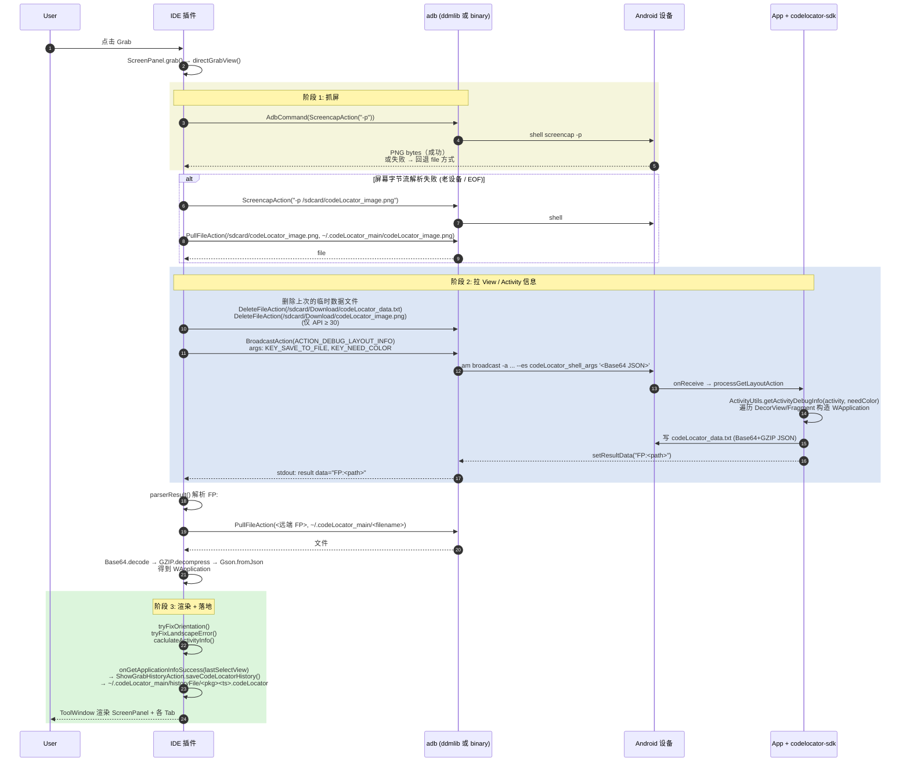

# 04 · 抓取流程详解（Grab View）

> 本文聚焦最常用的 "Grab" 流程：点击工具栏抓取按钮后，IDE 如何调起设备 SDK，把 View 树 / 截图 / Activity 信息全量拉回。
> 入口：`action/GrabViewAction.kt` → `panels/RootPanel.startGrab` → `panels/MainPanel.startGrab` → `panels/ScreenPanel.grab()`。

---

## 1. 用户路径

1. 用户保证已 `adb connect` 到设备 / 模拟器，且被调试 App 在前台。
2. App 工程里已经集成 `codelocator-sdk` 并初始化（`CodeLocator.init`），AndroidManifest 注册了 `CodeLocatorReceiver`。
3. 用户在 IDE 工具栏点击：
   - **Grab** → `GrabViewAction.actionPerformed` → `codeLocatorWindow.rootPanel.startGrab(null, stopAnim=false)`
   - **Grab+StopAnim** → `GrabViewWithStopAnimAction` → `startGrab(null, stopAnim=true)`

入口在 `action/GrabViewAction.kt:35-37`：

```kotlin
override fun actionPerformed(e: AnActionEvent) {
    codeLocatorWindow.rootPanel.startGrab()
    Mob.mob(Mob.Action.CLICK, Mob.Button.GRAB)
    ...
}
```

---

## 2. 两种抓取模式

`ScreenPanel.grab(WView lastSelectView, boolean stopAnim)` (`ScreenPanel.java:1801-1821`)：

```java
public void grab(WView lastSelectView, boolean stopAnim) {
    if (mIsGrabbing && (System.currentTimeMillis() - mLastGrabbingTime < 20_000L)) {
        return;
    }
    mIsGrabbing = true;
    mLastGrabbingTime = System.currentTimeMillis();
    ...
    if (stopAnim) {
        ThreadUtils.submit(() -> stopAnimAndGrabView(lastSelectView));
    } else {
        directGrabView(lastSelectView);
    }
}
```

| 模式 | 入口 | 与普通抓取的差异 |
|------|------|-----------------|
| Direct | `directGrabView()` | 先 screencap 截屏，截屏成功后再广播 `ACTION_DEBUG_LAYOUT_INFO` 拉 View 树 |
| StopAnim | `stopAnimAndGrabView()` | 一次性发广播 + 携带 `KEY_STOP_ALL_ANIM=2000`，并发起 screencap，等两个步骤都完成 |

20 秒锁是为了防止并发：如果上一次 grab 卡住超过 20 秒会被认为可重试。

---

## 3. 同步抓取主链路（directGrabView）



源码索引：

| 阶段 | 文件:行 |
|------|---------|
| 入口 | `action/GrabViewAction.kt:35` |
| `grab(stopAnim=false)` 主流程 | `panels/ScreenPanel.java:1801-1821` |
| `directGrabView` 截屏 | `panels/ScreenPanel.java:2013-2051` |
| `getScreenCapByFile` 文件兜底 | `panels/ScreenPanel.java:2130-2179` |
| `onGetScreenCapImage` 广播拉 View 树 | `panels/ScreenPanel.java:2200-2254` |
| `parserResult` 解析 | `device/DeviceManager.java:381-497` |
| 历史归档 | `panels/ScreenPanel.java:826-828` 调 `ShowGrabHistoryAction.saveCodeLocatorHistory` |

---

## 4. StopAnim 抓取链路（stopAnimAndGrabView）

`ScreenPanel.java:1823-1869` 的关键差异：

1. 先 `DeleteFileAction` 清理 `codeLocator_data.txt` 和 `codeLocator_image.png`
2. 一次性发广播：

   ```text
   am broadcast -a action_debug_layout_info \
     --es codeLocator_shell_args '<Base64({KEY_SAVE_TO_FILE,KEY_STOP_ALL_ANIM=2000,KEY_NEED_COLOR})>'
   ```

3. 紧跟着启动 `takeScreenShot()` 异步 screencap（`ScreenPanel.java:1941-2011`）
4. 设备端 SDK 在 `processGetLayoutAction` 拿到 `KEY_STOP_ALL_ANIM` 后会 `Thread.sleep(stopAnimTime)`（即在 dump View 后强制阻塞 2 秒，让动画停在 dump 时的状态）
5. 两个步骤都完成后 `checkStopGrabEnd()` 计数到 2，进入 `onStopGrabEnd()` 渲染

---

## 5. 前置条件清单

| 条件 | 说明 | 不满足时的表现 |
|------|------|---------------|
| 设备已连接 | `AndroidDebugBridge.getBridge().getDevices()` 非空 | `NoDeviceException`，提示 "no device" |
| 设备解锁 | `dumpsys activity activities` 能拿到 ResumedActivity | `DeviceUnLockException` |
| 被调试 App 在前台 | SDK 需要 `CodeLocator.getCurrentActivity() != null` | broadcast 返回 `NO_CURRENT_ACTIVITY` 错误 |
| App 已集成 SDK | App 的 manifest 注册了 `CodeLocatorReceiver` | broadcast 无返回 → IDE 走 dumpsys 兜底，标记 `isFromSdk=false`，仅有基础 View 信息 |
| SDK 已 `CodeLocator.init()` | SDK 内部全局配置已初始化 | broadcast 返回 → `SDKNotInitException` |
| Provider 已注册 | `<pkg>.CodeLocatorProvider` 在 manifest | 异步广播 / SDK 状态查询失败 |

---

## 6. 设备端落盘路径

> 实现来源：`CodeLocatorApp/CodeLocatorCore/.../FileUtils.java:143-150` 的 `getFile(context, fileName)`。**路径方向与 API 等级的关系如下，不要按"老版本走 ExternalCache、新版本走 /sdcard"的常见直觉脑补。**

| 文件 | 写入方 | 路径（API ≥ 30） | 路径（API < 30） |
|------|--------|------------------|------------------|
| dump 数据 | SDK | `/sdcard/codeLocator/codeLocator_data.txt`（`BASE_DIR_PATH`，调用前先 `verifyStoragePermissions`） | `<ExternalCacheDir>/codeLocator/codeLocator_data.txt` = `/sdcard/Android/data/<pkg>/cache/codeLocator/codeLocator_data.txt` |
| View 截图 | SDK | `/sdcard/codeLocator/codeLocator_image.png` | `/sdcard/Android/data/<pkg>/cache/codeLocator/codeLocator_image.png` |
| 全屏截图 | `screencap -p` | `/sdcard/codeLocator_image.png` (fallback 时) | 同左 |

> `TMP_TRANS_DATA_FILE_PATH = /sdcard/Download/codeLocator_data.txt` 是 IDE 端在 `getScreenCapByFile` 等场景**主动指定**的备用路径，不是 SDK `sendResult` 自动写入的位置——不要混淆。
>
> 反向操作时**不要按 API 等级硬编码路径**，而要从 broadcast `data="FP:<path>"` 字段动态取，再 `adb pull`。

---

## 7. IDE 端落盘路径

| 文件 | 写入时机 | 路径 |
|------|---------|------|
| 远端 dump payload 拉回 | 每次 grab | `~/.codeLocator_main/codeLocator_data.txt`（如果走文件回传）|
| 全屏截图 PNG | 每次 grab 成功 | `~/.codeLocator_main/screenCap.png`（`FileUtils.saveScreenCap`） |
| 历史 `.codeLocator` | 每次 grab 成功且非 Window 模式 | `~/.codeLocator_main/historyFile/<pkg><yyyy_MM_dd_HH_mm_ss>.codeLocator` |
| 最近 dump JSON 文本（调试用） | 每次 grab | `~/.codeLocator_main/runTimeInfo.txt` |
| 最近 broadcast 原始返回 | 每次 grab | `~/.codeLocator_main/commandData.txt` |
| 反馈包内最新抓取 | 用户点反馈 | `~/.codeLocator_main/grabInfo.codeLocator` |

历史文件命名规则：`ShowGrabHistoryAction.getCodeLocatorHistoryFile()` (`ShowGrabHistoryAction.kt:51-56`)

```kotlin
File(
    sCodelocatorHistoryFileDirPath,
    codeLocatorInfo.wApplication.packageName + sSimpleDateFormat.format(Date(grabTime)) + ".codeLocator"
)
```

历史文件总数受 `ProjectConfig.maxHistoryCount` 限制，溢出按 lastModified 降序删除最旧文件（`ShowGrabHistoryAction.kt:76-83`）。

---

## 8. 同步抓取 vs 异步抓取

由 `CodeLocatorUserConfig.isAsyncBroadcast()` 控制（`device/action/BroadcastAction.java:104-105`）：

```java
if (CodeLocatorUserConfig.loadConfig().isAsyncBroadcast()) {
    mArgsList.put(CodeLocatorConstants.KEY_ASYNC, "true");
}
```

| 模式 | 行为 | 适用场景 |
|------|------|---------|
| 同步（默认） | SDK 在 broadcast 收到时同步处理，结果通过 `setResultData` 返回 | 主线程不阻塞 / SDK 接收处理时已经能拿到当前 Activity |
| 异步 | SDK 通过 `CodeLocator.sHandler.post` 切到主线程处理；broadcast 立即返回；结果落地后由 `AsyncBroadcastHelper` 写到 SP；IDE 端轮询 `CodeLocatorProvider` 取 `AsyncResult` 字段 | 解决某些设备/版本上 broadcast 必须在 UI 线程处理但 receiver 不一定在 UI 线程的问题 |

`DeviceManager.getResultForAsyncBroadcast()` (`DeviceManager.java:499-532`)：

```java
while ("true".equals(asyncBroadcast) && !asyncResult.startsWith(ResultKey.FILE_PATH) && count <= maxTry) {
    response = executeCmd(new AdbCommand(new QueryContentAction(pkgAndActivityName.first + ".CodeLocatorProvider")));
    asyncBroadcast = grep("AsyncBroadcast=...");
    asyncResult   = grep("AsyncResult=...");
    Thread.sleep(500);
}
```

`maxAsyncTryCount` 默认值见 `CodeLocatorUserConfig`。

---

## 9. SDK 缺失 / 未初始化 fallback

`DeviceManager.getApplicationForNoSDK()` (`DeviceManager.java:314-357`)：

- 用 `IDevice.getClient(pkgName)` 判断进程是否可调试（debuggable）
- 走两条路径：
  - **Debug 模式**：通过 JDWP 直接 attach 拿 Activity / View 信息（`DataUtils.buildApplicationForNoSDKDebug`）
  - **Release 模式**：用 `uiautomator dump`（写 `/sdcard/codeLocator_temp.uix`） + 解析 XML 构造 `WApplication`（`DataUtils.buildApplicationForNoSDKRelease`）

这条 fallback 链路虽然能让用户看到 "App 没集成 SDK 也能看 View 树"，但拿到的 View 信息很少（没 `memAddr` → 不能 Edit / GetData / Invoke），并不能驱动反向操作。

---

## 10. 反向操作 MVP 建议

如果反向 skill 只复刻 grab 这一个能力，最小步骤：

```bash
PKG=com.xxx.yyy            # 被调试 App 包名（仅用于日志，路径不需要预拼）
SERIAL=...                 # 可选：adb -s
JSON='{"codeLocator_save_to_file":"true","codeLocator_need_color":"true"}'
# URL_SAFE / NO_PADDING / NO_WRAP base64（对齐 SDK SmartArgs.decode，详见 03 §4 ⚠）
B64=$(printf %s "$JSON" | base64 | tr -d '\n=' | tr '+/' '-_')
RESULT=$(adb shell "am broadcast -a com.bytedance.tools.codelocator.action_debug_layout_info \
    --es codeLocator_shell_args '$B64'")
# 从 RESULT 里 grep FP:<path>，路径由设备端 FileUtils.getFile 动态决定（API ≥ 30 走 /sdcard/codeLocator/，< 30 走 ExternalCacheDir）
FP=$(echo "$RESULT" | grep -oE 'FP:[^"]+' | sed 's/^FP://')
adb pull "$FP" /tmp/cl_data.txt
adb shell screencap -p > /tmp/cl_screen.png
# 解码：SDK 写文件的 payload 也是 URL_SAFE，先转回标准 base64 + 补 padding 再解
tr -d '\n' < /tmp/cl_data.txt | tr '_-' '/+' \
  | awk '{ pad=(4-length%4)%4; for(i=0;i<pad;i++) $0=$0"="; print }' \
  | base64 -d | gunzip > /tmp/cl_data.json
# 用 skill 的 parse-codelocator-file.ts 等价的解码逻辑解析 JSON 即可
```

> 注意：反向得到的 JSON 是 `ApplicationResponse`，结构是 `{ code, msg, data: WApplication }`，不是 `.codeLocator` 二进制格式。若要落成 `.codeLocator` 文件，需要按 `CodeLocatorInfo.toBytes()`（详见 **05-数据文件格式.md**）的二进制布局自行拼装。
