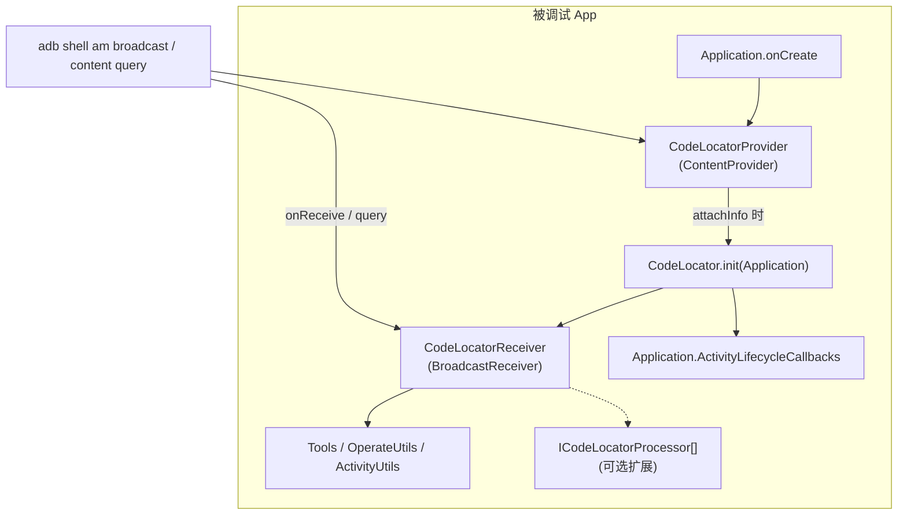

# 06 · 设备端 SDK 约定

> 本文从 IDE 端代码 + `CodeLocatorApp/CodeLocatorCore` 倒推设备端 SDK 的约束。
> 调研范围：`CodeLocatorApp/CodeLocatorCore/src/main/java/com/bytedance/tools/codelocator/`。
> 反向操作之所以必须依赖 SDK，是因为下面所有"能力"都来源于这个组件。

---

## 1. 角色定位



来源：
- `CodeLocator.java:106` 调 `registerReceiver()`，注册 9 个内置 action（`CodeLocator.java:397-405`）。
- `CodeLocatorProvider.java:20-23` 在 ContentProvider 的 `attachInfo` 阶段调用 `CodeLocator.init`，**这是 SDK 自启动的关键钩子**。
- 业务方在 AndroidManifest 里声明 `<provider name="com.bytedance.tools.codelocator.CodeLocatorProvider" authorities="${applicationId}.CodeLocatorProvider" />`，App 启动时 Android 框架会自动实例化它。

---

## 2. SDK 监听的 Broadcast Action 列表

`CodeLocator.registerReceiver()` (`CodeLocator.java:394-447`) 注册以下 **9 个内置 IntentFilter**：

| Action | 处理函数 | 返回 Response 类 | 主要参数 (`SmartArgs.getX` 的 key) |
|--------|---------|----------------|----------------------------------|
| `ACTION_DEBUG_LAYOUT_INFO` | `processGetLayoutAction` → `getTopActivityLayoutInfo` | `ApplicationResponse` | `KEY_NEED_COLOR`, `KEY_STOP_ALL_ANIM`, `KEY_ASYNC`, `KEY_SAVE_TO_FILE` |
| `ACTION_DEBUG_FILE_INFO` | `processGetFileAction` → `getFileInfo` | `FileResponse` | `KEY_SAVE_TO_FILE` |
| `ACTION_DEBUG_FILE_OPERATE` | `processFileOperateAction` | `FilePathResponse` | `KEY_PROCESS_SOURCE_FILE_PATH`, `KEY_PROCESS_TARGET_FILE_PATH`, `KEY_PROCESS_FILE_OPERATE`(pull/move/delete) |
| `ACTION_CHANGE_VIEW_INFO` | `processChangeViewAction` → `OperateUtils.changeViewInfoByCommand` | `OperateResponse` | `KEY_CHANGE_VIEW` (内嵌 OperateData JSON) |
| `ACTION_USE_TOOLS_INFO` | `processToolsAction` → `Tools.processTools` | `BaseResponse` | `KEY_TOOLS_COMMAND` (`COMMAND_UPDATE_ACTIVITY` 等) |
| `ACTION_GET_TOUCH_VIEW` | `processGetTouchViewAction` | `TouchViewResponse` | `KEY_SAVE_TO_FILE` |
| `ACTION_PROCESS_CONFIG_LIST` | `processConfigListAction` | `StatesResponse` | `KEY_CODELOCATOR_ACTION` (add/set/clear), `KEY_CONFIG_TYPE`, `KEY_DATA` |
| `ACTION_PROCESS_SCHEMA` | `processSchemaAction` | `StatesResponse(true/false)` | `KEY_SCHEMA` |
| `ACTION_CONFIG_SDK` | `processConfigSDk` | `StatesResponse` | `KEY_CONFIG_TYPE` (`FECTH_URL`/`ASYNC_BROADCAST`), `KEY_CODELOCATOR_ACTION`, `KEY_DATA` |
| 业务自定义 action | `ICodeLocatorProcessor.processIntentAction` | 任意 `BaseResponse` 子类 | 业务自定义 |

> ⚠ **下面这些 action 不在内置 IntentFilter 列表里、默认收不到**：
>
> - `ACTION_MOCK_TOUCH_VIEW`：`CodeLocatorReceiver.onReceive` 的 switch 写了 `case ACTION_MOCK_TOUCH_VIEW`（`CodeLocatorReceiver.java:133`），但 `registerReceiver()` 没把它加进 IntentFilter（`CodeLocator.java:397-405`），实测 broadcast 不会被命中。要用必须业务方通过 `ICodeLocatorProcessor.providerRegisterAction()` 自行注册。
> - `ACTION_OPERATE_CUSTOM_FILE`：grep 整个 `CodeLocatorApp/CodeLocatorCore/` 0 命中。IDE 端 `EditFileContentDialog / FileOperateAction` 会发这个 action，但 SDK Receiver case 列表没它。同样属业务方扩展点。
> - 上面两个都依赖业务方通过 `ICodeLocatorProcessor` 注入处理逻辑——属可选能力，**反向 skill 不要默认依赖**。

---

## 3. 参数封装：`SmartArgs`

`CodeLocatorReceiver.onReceive` (`CodeLocatorReceiver.java:98`) 用 `SmartArgs` 包裹 Intent，把 `--es codeLocator_shell_args '<Base64 JSON>'` 解开成一个 map 形式访问：

- `smartArgs.getString(key)`
- `smartArgs.getInt(key, default)`
- `smartArgs.getLong(key)` / `getBoolean` / `getDouble` / `getFloat`
- `smartArgs.getData(key, Class)` — 把 value 视为 JSON 字符串再反序列化（用在 `KEY_CHANGE_VIEW`）

> 这意味着：**反向操作时所有 args 的值都应该是 JSON 里的字符串**，类型转换交给 SDK。

---

## 4. 返回机制：`setResultData`

`CodeLocatorReceiver.sendResult` (`CodeLocatorReceiver.java:493-542`)：

```java
compressData = Base64.encodeToString(CodeLocatorUtils.compress(Gson.toJson(BaseResponse)));
saveToFile  = isAsync || KEY_SAVE_TO_FILE || compressData.length > maxBroadcastTransferLength;
if (saveToFile) {
    file = FileUtils.getFile(context, "codeLocator_data.txt");
    save(compressData, file);
    setResultData("FP:" + file.absolutePath);
} else {
    setResultData(compressData);
}
```

特殊情况：

- 异步模式（`KEY_ASYNC=true`）：除了 setResultData，还会调 `AsyncBroadcastHelper.sendResultForAsyncBroadcast` 把同样的 `"FP:<path>"` 字符串塞进设备 SharedPreferences，等 IDE 端 `content query` 时由 `CodeLocatorProvider` 返回。
- 文件回传超大也写文件：默认阈值 = `getMaxBroadcastTransferLength()` = **240000 (240KB)**，定义在 SDK `CodeLocatorConfig.java:22` 的 `DEFAULT_MAX_BROADCAST_TRANSFER_LENGTH`，Builder 可覆盖。
- 写文件失败时回写 ErrorResponse(`FILE_NOT_EXIST`)。

---

## 5. SDK 写文件位置

`FileUtils.getFile(context, fileName)`（`CodeLocatorApp/CodeLocatorCore/.../FileUtils.java:143-150`）实现：

```java
File fileStreamPath = new File(context.getExternalCacheDir(),
    BASE_DIR_NAME + File.separator + fileName);
if (Build.VERSION.SDK_INT >= USE_TRANS_FILE_SDK_VERSION) {
    verifyStoragePermissions(CodeLocator.getCurrentActivity());
    fileStreamPath = new File(codeLocatorTmpDir, fileName);  // codeLocatorTmpDir = BASE_DIR_PATH
}
return fileStreamPath;
```

- **API ≥ 30**：写到 `/sdcard/codeLocator/<fileName>`（即 `BASE_DIR_PATH`），调用前会触发 `verifyStoragePermissions` 申请旧 SDcard 写权限。
- **API < 30**：写到 `context.getExternalCacheDir() + "/codeLocator/" + fileName` = `/sdcard/Android/data/<pkg>/cache/codeLocator/<fileName>`。

> 注：`TMP_TRANS_DATA_FILE_PATH = /sdcard/Download/codeLocator_data.txt` 只在 IDE 端 `getScreenCapByFile` 等场景主动指定路径时用，**不是** SDK `sendResult` 的默认落盘位置——不要混淆。

常量见 `CodeLocatorConstants`（详 03 文档）：

| 常量 | 路径 |
|------|------|
| `BASE_DIR_PATH` | `/sdcard/codeLocator` |
| `BASE_TMP_DIR_PATH` | `/data/local/tmp/codeLocator` |
| `TMP_TRANS_DATA_DIR_PATH` | `/sdcard/Download/` |
| `TMP_TRANS_DATA_FILE_PATH` | `/sdcard/Download/codeLocator_data.txt` |
| `TMP_TRANS_IMAGE_FILE_PATH` | `/sdcard/Download/codeLocator_image.png` |
| `TMP_DATA_FILE_NAME` | `codeLocator_data.txt` |
| `TMP_IMAGE_FILE_NAME` | `codeLocator_image.png` |

---

## 6. `CodeLocatorProvider` 的角色

`CodeLocatorProvider.java:32-41` 注册一个 `MatrixCursor`，列名固定：

| 列 | 含义 | 由谁写入 |
|----|------|---------|
| `CodeLocatorVersion` | SDK 版本（`BuildConfig.VERSION_NAME`） | 编译期 |
| `AsyncBroadcast` | 是否启用异步广播（`true`/`false`） | `ACTION_CONFIG_SDK + EditType.ASYNC_BROADCAST` 或 `AsyncBroadcastHelper.setEnableAsyncBroadcast` |
| `AsyncResult` | 最近一次异步广播的 `FP:<path>`（异步模式专用） | `AsyncBroadcastHelper.sendResultForAsyncBroadcast` |

> Provider 是 **唯一**不靠广播也能调用的 SDK 接口。反向操作流程里它有 3 个用途：
> 1. **健康检查**：`content query` 成功 → SDK 已初始化、应用在前台。
> 2. **取 SDK 版本**：用于决定走 file 通道还是 inline 通道。
> 3. **轮询异步结果**：异步抓取后每 500ms 查一次直到 `AsyncResult` 不为空。

Provider 的 attachInfo 阶段调用 `CodeLocator.init`，所以**只要 Application 实例化，CodeLocator 就一定 init 过**——这是 SDK 的关键约束，避免业务方忘记调 `CodeLocator.init`。

---

## 7. SDK 生命周期：何时可用

`CodeLocator.registerLifecycleCallbacks` (`CodeLocator.java:461`)：

- 进入前台（首个 onResume）→ `registerReceiver()`，SDK 可用。
- 退到后台（最后一个 onPause）→ `unRegisterReceiver()` + `deleteAllChildFile(sCodeLocatorDir)`，SDK 不可用。

意味着**反向操作的 broadcast 在 App 进入后台时会被丢弃，没有错误返回，只是无人接收**。检测方法：

- broadcast 没返回（`adb shell am broadcast` 的 `data=` 为空），且
- `content query --uri content://<pkg>.CodeLocatorProvider` 仍然能返回（Provider 永远在），但 `AsyncBroadcast=false`、`AsyncResult=`。

判断条件："Provider 可查 + Receiver 无响应" ≈ "App 在后台或没有当前 Activity"。

---

## 8. SDK 内核能力（IDE 用到的）

从 `processGetLayoutAction → ActivityUtils.getActivityDebugInfo` 看 SDK 在设备侧能做的事：

| 能力 | 出口 |
|------|------|
| 遍历 `Application.activities → DecorView → 全 View 树` | `ActivityUtils.getActivityDebugInfo` |
| 反射读取 View 的所有 padding/margin/visibility/text/color 等属性 | `WView` 字段 |
| 读取每个 View 的 `setTag(R.id.codeLocator_*)` 标记（编译期 Lancet 插桩） | `CodeLocatorConstants.R.id.*` |
| 取 View 截图 / Foreground / Background 分层位图 | `OperateUtils + EditType.VIEW_BITMAP` |
| 拉应用沙盒文件树 | `ActivityUtils.getFileInfo` |
| 反射调 View 方法（`EditType.INVOKE`） | `OperateUtils.changeViewInfoByCommand` |
| 关闭 Activity | `EditType.CLOSE_ACTIVITY` |
| 注册/清空 ignore 列表（Activity/View/Popup/Dialog/Toast） | `ACTION_PROCESS_CONFIG_LIST + KEY_ACTION_ADD/CLEAR + KEY_CONFIG_TYPE` |
| 写自定义 ExtraInfo 到 SharedPreferences | `KEY_ACTION_SET + appendExtraViewInfoIntoSp` |
| 处理 Schema（走 `AppInfoProvider.processSchema`） | `ACTION_PROCESS_SCHEMA` |

---

## 9. 编译期 / 集成要求

| 要求 | 来源 | 影响 |
|------|------|------|
| 业务 App 集成 `codelocator-sdk`（`com.bytedance.tools:codelocator-sdk`） | `CodeLocatorCore` 编译目标 | 没集成 → 设备端没 Receiver / Provider，反向不可用 |
| 在 AndroidManifest 声明 `<provider authorities="${applicationId}.CodeLocatorProvider"/>` | `CodeLocatorCore/src/main/AndroidManifest.xml:11-16`（合并到业务 manifest） | 没声明 → SDK 自启动失败、Provider query 失败 |
| `CodeLocator.init(Application)` 在 `attachInfo` 自动触发 | `CodeLocatorProvider.attachInfo` | 业务方不需要手动调，但需要业务方**没有 disable** Provider |
| **Lancet 插桩**（可选） | `CodeLocatorApp` 的 `codelocator-lancet` 模块 | 启用后能在 setOnClickListener / setOnTouchListener / findViewById / inflate XML 等时机自动 setTag → 让 IDE 端 "Find OnClick / Find XML / Find OnTouch" Action 有数据 |
| `TYPE_ENABLE_CODELOCATOR_LANCET` (`enable_codelocator_lancet`) 配置项 | `CodeLocatorConstants.java:116` | 设备端 ignore 列表 / SDK 配置可关闭 Lancet |
| 业务方可选实现 `ICodeLocatorProcessor` | `CodeLocator.sGlobalConfig.getCodeLocatorProcessors()` | 注册自定义 Action / 自定义 ExtraInfo / 自定义 Schema 处理 |

---

## 10. SDK 与 Xposed / 类似工具的关系

仓库内未发现 Xposed 钩子；SDK 完全在 App 进程内运行，通过：

- ContentProvider 自启动
- BroadcastReceiver 接收 IDE 命令
- 反射 + Lancet 插桩拿到 View / Activity 内部状态

所以**反向操作不需要 root / Xposed**，只要 `adb` 能跟设备通讯且业务 App 集成了 SDK。

---

## 11. 已澄清 / 待实测项

**已澄清（曾经的 ❓ 已回填到正文）**：

- `ACTION_OPERATE_CUSTOM_FILE`：SDK 内置不处理，靠业务方 `ICodeLocatorProcessor` 扩展（详 §2）。
- `FileUtils.getFile` 在不同 API 等级的实际目录：见 §5 已重写（30+ 走 `/sdcard/codeLocator/`，<30 走 ExternalCacheDir）。
- `getMaxBroadcastTransferLength()` 默认值：240000 (240KB)，见 §4 已写明。

**仍需真机或业务方编译产物实测的项**：

- ❓ `sCodeLocatorDir` 在 SDK 进入后台时被 `deleteAllChildFile` 清空（`CodeLocator.unRegisterReceiver` 路径），是否会导致 "回到前台后第一次 grab 数据被删" 的问题。从代码看是收尾清理，broadcast 时会重新创建，但未实测。
- ❓ `BuildConfig.VERSION_NAME` 在 SDK 集成方编译产物中的实际值：取决于业务方 build.gradle 的 versionName 覆盖。SDK 自带的 BuildConfig 在 release.aar 时被锁死，需业务方实测。
- ❓ 用 `ACTION_DEBUG_LAYOUT_INFO` 单次抓取时 `WApplication.file`（`b8`）字段是否带文件信息：源码看在 `ActivityUtils.getActivityDebugInfo` 里不主动填充，要通过 `ACTION_DEBUG_FILE_INFO` 单独抓取——但尚未真机实测确认 default value 是 null 还是空树。

---

## 12. 反向 skill 视角的 "SDK 探测脚本"

```bash
PKG=com.xxx.yyy

# 1. SDK 是否注册了 Provider？
HEALTH=$(adb shell "content query --uri content://${PKG}.CodeLocatorProvider" 2>&1)
if echo "$HEALTH" | grep -q "No result found"; then
    echo "SDK 未集成或 Provider 未注册"
    exit 2
fi
echo "$HEALTH"
# 期望输出含: CodeLocatorVersion=..., AsyncBroadcast=true/false, AsyncResult=...

# 2. App 是否在前台？
CUR=$(adb shell "dumpsys activity activities" | grep -i ResumedActivity | head -1)
if echo "$CUR" | grep -q "$PKG"; then
    echo "前台进程是 $PKG，SDK Receiver 应该可用"
else
    echo "App 不在前台，broadcast 可能不会被响应"
fi

# 3. 一次健康抓取（URL_SAFE base64，对齐 SDK SmartArgs.decode，详见 03 §4 ⚠）
ARGS=$(printf '{"codeLocator_save_to_file":"true"}' | base64 | tr -d '\n=' | tr '+/' '-_')
RESP=$(adb shell "am broadcast -a com.bytedance.tools.codelocator.action_debug_layout_info \
    --es codeLocator_shell_args '$ARGS'")
echo "$RESP" | grep -oE 'data="[^"]+"'
```
