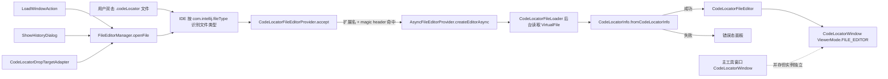

# 技术方案：IDEA 插件直接打开 `.codeLocator` 文件

## 1. 方案概述

### 1.1 背景

当前 CodeLocator 插件已经具备 `.codeLocator` 文件的完整读写能力，但入口仍以“工具栏手动加载”“历史记录列表打开”“拖拽文件到工具窗口”三类方式为主：

- 保存入口：`SaveWindowAction`
- 手动加载入口：`LoadWindowAction`
- 历史记录入口：`ShowGrabHistoryAction` / `ShowHistoryDialog`
- 拖拽入口：`CodeLocatorDropTargetAdapter`
- 底层二进制解析：`CodeLocatorInfo.fromCodeLocatorInfo(...)`

这说明核心能力已经存在，当前缺的不是“能不能解析文件”，而是“IDE 是否把 `.codeLocator` 当成一类一等文件类型来打开”。用户在 Project View、Finder、Recent Files 或历史目录中双击 `.codeLocator` 文件时，预期是直接进入 CodeLocator 专用查看界面，而不是先打开工具窗口再手动选择文件。

### 1.2 目标

本方案目标是在 IntelliJ IDEA / Android Studio 中增加 `FileEditorProvider` 能力，使 `.codeLocator` 文件在 IDE 内具备如下体验：

1. 双击 `.codeLocator` 文件即可打开专用编辑器页签。
2. 编辑器内直接展示现有 CodeLocator 视图能力，而不是弹出额外对话框。
3. 与现有“保存 / 加载 / 历史记录 / 拖拽打开”能力保持兼容。
4. 打开过程不阻塞 EDT，失败时给出可诊断的错误态。
5. 首期实现聚焦 IDE 内打开体验，不把系统级文件关联自动配置作为强依赖。

### 1.3 范围

**本期范围内：**

- 注册 `.codeLocator` 对应的 `FileType`
- 注册 `FileEditorProvider` 与自定义 `FileEditor`
- 解析文件并复用现有 `CodeLocatorInfo` / `CodeLocatorWindow` 展示能力
- 支持在 Project View、Recent Files、Find Action、历史目录等 IDE 内入口直接打开
- 为异常文件、超大文件、无项目上下文等场景提供兜底体验

**本期范围外：**

- 自动修改 macOS / Windows / Linux 的系统默认文件关联
- 改造 `.codeLocator` 文件格式本身
- 重写整套 CodeLocator UI
- 增加在线协作、注释、编辑回写等复杂编辑能力

### 1.4 价值

- **降低使用门槛**：用户不需要记住“先打开工具窗口，再点 Load”。
- **统一文件心智**：`.codeLocator` 从“插件内部数据文件”升级为“IDE 可直接打开的调试快照文件”。
- **复用已有资产**：底层解析与展示能力已基本存在，新增工作更偏插件接线与状态治理。
- **为后续能力铺路**：后续可自然扩展为最近文件、差异对比、固定页签、从历史文件夹直接 review 等场景。

---

## 2. 整体架构

### 2.1 设计原则

1. **以复用为先**：优先复用 `CodeLocatorInfo` 的二进制解析能力与 `CodeLocatorWindow` 的现有展示逻辑。
2. **以编辑器为宿主**：从“弹窗式查看”升级为“编辑器页签式查看”，但不复制一套新 UI。
3. **解析与展示解耦**：文件读取 / 校验 / 解析放在独立层，编辑器层只消费结果。
4. **状态隔离优先于状态共享**：每个 `.codeLocator` 页签拥有独立 viewer 实例，避免 Swing 组件与主要交互状态互相污染。
5. **异步优先**：文件 I/O 与反序列化不在 EDT 执行，先完成后台准备，再构建正式 UI。

### 2.2 架构图



### 2.3 模块划分

建议将实现划分为四层：

#### A. 文件识别层

职责：让 IDE 识别 `.codeLocator` 文件并把打开动作路由到插件。

建议新增：

- `CodeLocatorFileType`
- `plugin.xml` 中的 `com.intellij.fileType` 注册

说明：本文件类型是**二进制快照文件**，不需要 `LanguageFileType`、`ParserDefinition`、`FileViewProviderFactory` 这类语言级扩展。

#### B. 编辑器宿主层

职责：适配 IntelliJ 平台 `FileEditor` 生命周期。

建议新增：

- `CodeLocatorFileEditorProvider`
- `CodeLocatorFileEditor`
- `CodeLocatorEditorState`（可选；v1 可直接用 `FileEditorState.INSTANCE`）
- `CodeLocatorErrorPanel`（可选；也可以内嵌在 `FileEditor` 中）

#### C. 解析服务层

职责：统一处理 `.codeLocator` 文件的读取、大小校验、magic header 校验、解析与错误转换。

建议新增：

- `CodeLocatorFileLoader`
- `CodeLocatorFileOpenResult`（`Success / InvalidFormat / TooLarge / IoError`）

它负责把当前散落在 `LoadWindowAction`、`ShowHistoryDialog`、`CodeLocatorDropTargetAdapter` 中的“读取文件字节 + 调 `CodeLocatorInfo.fromCodeLocatorInfo` + 判空报错”逻辑收敛成一个公共入口，避免后续一处改协议、多处改调用。

#### D. 视图承载层

职责：将解析后的 `CodeLocatorInfo` 呈现为用户可操作的 CodeLocator 界面。

首选方案是复用 `CodeLocatorWindow(project, isWindowMode = true, codelocatorInfo = ...)` 的现有能力，再在外层补一个 editor host 容器处理错误态、生命周期与后续模式区分。

### 2.4 数据流

1. 用户双击 `.codeLocator` 文件。
2. IDE 根据 `com.intellij.fileType` 命中 `CodeLocatorFileType`。
3. `CodeLocatorFileEditorProvider.accept(...)` 先按扩展名命中，再用最小 header 校验确认确实是 CodeLocator 文件。
4. `AsyncFileEditorProvider.createEditorAsync(...)` 在后台线程读取 `VirtualFile` 内容。
5. `CodeLocatorFileLoader` 执行：
   - 文件存在性校验
   - 大小阈值校验
   - 最小 header 校验
   - `CodeLocatorInfo.fromCodeLocatorInfo(...)`
   - 结果映射为 `Success / InvalidFormat / TooLarge / IoError`
6. 解析成功后，Builder 在 EDT 中构建 `CodeLocatorFileEditor`。
7. `CodeLocatorFileEditor` 内部创建独立的 `CodeLocatorWindow` viewer，并挂载到 editor tab。
8. 解析失败时，FileEditor 展示错误态面板，并提供 `Reload` / `Copy Path` 等最小兜底动作。
9. `LoadWindowAction`、`ShowHistoryDialog`、`CodeLocatorDropTargetAdapter` 后续统一改为 `FileEditorManager.openFile(...)`，让所有入口收敛到同一条 editor 打开链路。

### 2.5 与现有工具窗口的并存关系

- 主工具窗口仍承担**实时抓取设备、联机调试、触发动作**的职责。
- File Editor 承担**离线快照查看**职责。
- 两者复用同一套 viewer 类，但**不共享 Swing 实例**。
- 两者在语义上也不做自动同步：一个面向设备实时态，一个面向磁盘离线态。

---

## 3. 关键技术决策

### 3.1 文件类型注册：使用 `com.intellij.fileType`，不再引入 `FileTypeFactory`

**决策**：使用 `plugin.xml` 中的 `com.intellij.fileType` 扩展点注册 `.codeLocator` 文件类型，不使用 `FileTypeFactory`。

**为什么：**

1. JetBrains 官方文档已把 `com.intellij.fileType` 作为标准注册方式。
2. JetBrains 扩展点列表中，`fileTypeFactory` 已标记为 **Deprecated / Non-Dynamic**。
3. 本项目最低支持 `since-build = 232`，没有任何兼容性理由继续走旧机制。

**实现约束：**

- `.codeLocator` 是二进制快照，不是语言文件。
- 首版只需 `FileType`，不需要 `LanguageFileType`、`ParserDefinition`、`FileViewProviderFactory`。

### 3.2 `FileEditorPolicy`：选择 `HIDE_DEFAULT_EDITOR`

**决策**：File Editor 策略采用 `FileEditorPolicy.HIDE_DEFAULT_EDITOR`。

**为什么：**

1. `.codeLocator` 是二进制快照，默认文本页签基本无可读价值。
2. 用户的目标是“直接进入专用 viewer”，不是“文本页签 + 预览页签”。
3. 如果保留默认文本编辑器，会让用户误以为文件可以直接编辑，也会增加 tab 噪音和状态管理复杂度。

**与其它选项的取舍：**

- `PLACE_BEFORE_DEFAULT_EDITOR` / `PLACE_AFTER_DEFAULT_EDITOR` 更适合“文本为主、预览为辅”的格式，本方案不属于这一类。
- 调研中也确认 `HIDE_DEFAULT_EDITOR` 在官方 API 与社区讨论中仍然是可接受、稳定的策略。

### 3.3 `DumbAware`：Provider 层支持索引期打开

**决策**：`CodeLocatorFileEditorProvider` 实现 `DumbAware`。

**为什么：**

1. `.codeLocator` 打开流程只依赖本地文件读取和反序列化，不依赖索引。
2. 用户在 indexing 期间也应能查看离线快照。
3. 即使 viewer 里的少数源码跳转能力后续依赖索引，也应做到“文件可打开、增强动作按需降级”，而不是整体不可用。

### 3.4 异步加载：优先 `AsyncFileEditorProvider`

**决策**：使用 `AsyncFileEditorProvider`，而不是在 `FileEditor` 内部手写 `SwingWorker`。

**为什么：**

1. `.codeLocator` 的打开成本主要包括整文件读取、`WApplication` JSON 反序列化、PNG 解码，天然适合“后台准备 + EDT build UI”的模式。
2. `AsyncFileEditorProvider` 与 FileEditorManager 的打开链路天然对齐，线程切换与生命周期更清晰。
3. 手写 `SwingWorker` 会把取消、异常展示、重复打开去重等问题散落到业务代码里。

**具体策略：**

- `accept()` 只做扩展名 + 最小 header 校验，不做完整解析。
- `createEditorAsync()` 做完整读取与解析。
- `build()` 仅组装 `CodeLocatorFileEditor` 与最终 viewer。
- 如果后续还需要“加载中”占位体验，可再补 `LoadingDecorator`，但不作为首版阻塞项。

### 3.5 文件判定：扩展名 + magic header 双重校验

**决策**：`accept(Project, VirtualFile)` 采用“双重判定”而不是只看后缀。

**为什么：**

1. 只看扩展名，重命名的普通文件也会误命中。
2. 直接做完整解析，会让 `accept()` 过重。
3. `CodeLocatorInfo.fromCodeLocatorInfo()` 已明确给出格式协议：前缀 tag 必须是 `CodeLocator`。

**建议逻辑：**

- 扩展名必须是 `codeLocator`
- 读取前 4 字节得到 tag 长度
- 再读取 tag 文本
- 必须等于 `CodeLocator`

### 3.6 状态隔离：每个页签独立持有 viewer 实例，但接受少量全局上下文仍共享

**决策**：每个 `.codeLocator` 页签独立构造 `CodeLocatorWindow`、`RootPanel`、`MainPanel`、`ScreenPanel`，不共享 Swing 实例；同时承认当前项目里仍存在少量进程级共享状态。

**为什么：**

1. Swing 组件本身不能同时挂到多个父容器。
2. 当前对话框模式已验证“每次打开快照就新建一个 `CodeLocatorWindow`”是可行路径。
3. `MainPanel` / `RootPanel` 自身以实例字段为主，并没有发现类似 `sCodeLocatorInfo` 的致命静态单例。

**需明确的现实边界：**

当前仍有以下共享状态，不应夸大为“完全实例隔离”：

- `CodeLocatorWindow.codeLocatorMap`
- `DataUtils.sCurrentProjectName / sCurrentApkName / sCurrentSDKVersion`
- `CodeLocatorUserConfig.sCodeLocatorConfig`
- `FileUtils.getConfig()` 背后的全局配置
- `ScreenPanel` 的部分静态点击/提示计数

所以首版的正确表述是：**viewer 组件实例隔离，但项目/进程级上下文仍有共享，需要在后续阶段继续收敛。**

### 3.7 复用策略：继续复用 `CodeLocatorWindow`，但应补 `FILE_EDITOR` 语义

**决策**：首版继续复用 `CodeLocatorWindow(project, isWindowMode = true, codelocatorInfo = ...)`，不重写完整 viewer。

**为什么：**

1. 现有窗口已承载截图预览、View 树、属性、Action 工具栏、文件树、Extra 信息等完整能力。
2. `isWindowMode = true` 的离线快照展示链路已经跑通，说明核心渲染能力本来就是可嵌入的。
3. 当前最需要治理的是“作为 editor tab 打开”，而不是“重做一套 UI”。

**需要补的语义改进：**

- 当前 `isWindowMode` 实际承载了“对话框快照模式”和“未来 File Editor 模式”两类语义。
- 建议后续演进为 `ViewerMode.TOOL_WINDOW / DIALOG / FILE_EDITOR`，让埋点、联动、Action 控制更清晰。

### 3.8 `FileEditorState`：v1 不做复杂持久化

**决策**：首版 `FileEditor.getState()` 直接返回 `FileEditorState.INSTANCE`，`setState()` 空实现。

**为什么：**

1. 当前 UI 状态分散在多棵树、多张表和多种选择逻辑中，没有现成稳定的可序列化路径模型。
2. 首版的核心目标是“稳定打开与查看”，不是“精细恢复树展开状态”。
3. 过早引入状态持久化，会把 tab、ViewTree、ActivityTree、FileTree、Extra 面板状态同时拉进设计范围，收益不匹配复杂度。

**后续可考虑的最小持久化：**

- 当前 tab index
- 当前选中 View 的 `memAddr`

### 3.9 系统级文件关联：IDE 内支持是必须项，OS 级关联是增强项

**决策**：首版交付只承诺 IDE 内正确识别与打开 `.codeLocator`；系统层面的默认应用设置不作为阻塞项。

**为什么：**

1. Finder / Explorer / Linux 文件管理器双击的第一步是“操作系统决定交给哪个应用”，这不由插件直接控制。
2. 插件真正负责的是：一旦 IDE 接管该文件，能否按专用 editor 正确展示。
3. JetBrains 的 `OSFileIdeAssociation` 可作为后续增强，但不是首版完成条件。

---

## 4. 现有代码改造清单

### 4.1 可原样复用的类

| 类 / 文件 | 复用方式 | 依据与原因 |
| --- | --- | --- |
| `model/CodeLocatorInfo.java` | 原样复用 | 已完整定义 `.codeLocator` 协议与 `fromCodeLocatorInfo()` 解析逻辑，含 tag 校验、JSON 恢复、PNG 解码。 |
| `utils/DataUtils.restoreAllStructInfo()` | 原样复用 | 已负责 `WApplication` 结构恢复、排序、跳转信息补全。 |
| `panels/RootPanel.kt` | 原样复用 | 主要承担 viewer 容器与默认空态绘制，状态以实例字段为主。 |
| `panels/MainPanel.kt` | 原样复用 | 已完成屏幕面板与 Tab 面板编排、交互桥接、横竖屏布局调整。 |
| `panels/ScreenPanel.java` | 原样复用为主 | 已支持 `notifyGetCodeLocatorInfo()` 将离线快照灌入现有界面。 |
| `panels/TabContainerPanel.kt` | 原样复用 | 已组装 View/Activity/File/AppInfo/Extra 等 tabs。 |
| `panels/ViewTreePanel.kt` / `ActivityTreePanel.kt` / `FileTreePanel.kt` | 原样复用 | 属于 viewer 细分子面板，不必为 File Editor 单独重写。 |
| `panels/AppInfoTablePanel.kt` / `ViewInfoTablePanel.kt` / `FragmentInfoTablePanel.kt` / `FileInfoTablePanel.kt` | 原样复用 | 属于纯展示面板，结构稳定。 |
| `panels/ExtraSplitPane.java` / `ExtraTreePanel.kt` / `ExtraInfoTablePanel.kt` | 原样复用 | 属于 Extra 信息展示链路，和打开载体关系不大。 |
| `action/SaveWindowAction.kt` | 原样复用 | 已能把 `currentApplication + screenCapImage` 再打包成 `.codeLocator`。 |

### 4.2 需要改造的类

| 类 / 文件 | 改造原因 | 建议改造点 |
| --- | --- | --- |
| `panels/CodeLocatorWindow.kt` | 当前只区分工具窗口 / 非工具窗口，不足以准确表达 File Editor 语义 | 补充 `ViewerMode` 概念；区分 TOOL_WINDOW / DIALOG / FILE_EDITOR；按 mode 控制埋点、联动与可见 Action。 |
| `tools/CodeLocatorDropTargetAdapter.kt` | 当前 `.codeLocator` 分支直接弹对话框，和新 editor 体验割裂 | 保留 APK / dependencies 逻辑；把 `.codeLocator` 分支改为 `FileEditorManager.openFile(vFile, true)`。 |
| `action/LoadWindowAction.kt` | 当前选择文件后直接解析并弹对话框 | 选择文件后改为定位 `VirtualFile` 并 `openFile()`；文件解析逻辑收口到 loader。 |
| `dialog/ShowHistoryDialog.kt` | 当前点击历史项直接解析并弹对话框 | 历史项点击后直接调用 `FileEditorManager.openFile()`，统一入口结果。 |
| `action/ShowGrabHistoryAction.kt` | 功能可保留，但要配合历史项打开策略变化 | 保留列表与扫描逻辑，不再直接依赖对话框式打开结果。 |
| `utils/CodeLocatorFileParser.java` | 目标是“解析并导出 JSON + PNG”，带磁盘副作用 | 不进入 editor 打开主链路；仅保留为独立导出工具。 |
| `panels/ScreenPanel.java` | 作为 File Editor 使用时仍会触发本地截图缓存副作用 | 评估是否在 FILE_EDITOR 模式下跳过 `FileUtils.saveScreenCap()`，避免每次打开离线文件都覆盖缓存截图。 |
| `utils/Mob.java` + `CodeLocatorWindow` 埋点调用 | File Editor 打开若仍按 window/dialog 统计，会污染埋点语义 | 后续为 FILE_EDITOR 模式补细分埋点或降低 show 埋点耦合。 |

### 4.3 新增的类与建议签名

#### 4.3.1 `CodeLocatorFileType`

```kotlin
object CodeLocatorFileType : FileType
```

职责：

- 声明名称、描述、默认扩展名、图标、二进制属性、只读属性。

说明：

- 这是少数可以接受使用 Kotlin `object` 的扩展实现，因为 `com.intellij.fileType` 注册通常会通过 `fieldName="INSTANCE"` 指向单例实例。

#### 4.3.2 `CodeLocatorFileEditorProvider`

```kotlin
class CodeLocatorFileEditorProvider : AsyncFileEditorProvider, DumbAware
```

职责：

- `accept(Project, VirtualFile)`：扩展名 + magic header 双重校验
- `createEditorAsync(Project, VirtualFile)`：后台准备 `CodeLocatorInfo`
- `getEditorTypeId()`：返回稳定唯一 ID
- `getPolicy()`：返回 `HIDE_DEFAULT_EDITOR`

#### 4.3.3 `CodeLocatorFileEditor`

```kotlin
class CodeLocatorFileEditor(
    private val project: Project,
    private val file: VirtualFile,
    private val openResult: CodeLocatorFileOpenResult,
) : UserDataHolderBase(), FileEditor
```

职责：

- 承担 FileEditor 协议
- 成功时持有 `CodeLocatorWindow`
- 失败时持有错误态组件
- v1 返回 `FileEditorState.INSTANCE`

#### 4.3.4 `CodeLocatorFileLoader`

```kotlin
class CodeLocatorFileLoader {
    fun hasValidHeader(file: VirtualFile): Boolean
    fun load(file: VirtualFile): CodeLocatorFileOpenResult
}
```

职责：

- 统一最小 header 校验
- 统一大小阈值
- 统一 `CodeLocatorInfo.fromCodeLocatorInfo(...)`
- 统一把异常映射为 UI 层能消费的结果类型

#### 4.3.5 `CodeLocatorFileOpenResult`

```kotlin
sealed interface CodeLocatorFileOpenResult {
    data class Success(val info: CodeLocatorInfo) : CodeLocatorFileOpenResult
    data class InvalidFormat(val message: String) : CodeLocatorFileOpenResult
    data class TooLarge(val actualBytes: Long, val limitBytes: Long) : CodeLocatorFileOpenResult
    data class IoError(val message: String, val cause: Throwable? = null) : CodeLocatorFileOpenResult
}
```

职责：

- 为 editor host 提供稳定的成功/失败建模，避免在 UI 层四处 `try/catch + null`。

#### 4.3.6 `CodeLocatorErrorPanel`（可选）

```kotlin
class CodeLocatorErrorPanel(
    file: VirtualFile,
    message: String,
    onReload: (() -> Unit)? = null,
) : JPanel()
```

职责：

- 统一承载非法文件、解析异常、超大文件、无项目上下文等错误态展示。

### 4.4 `plugin.xml` 受影响扩展点

首版必须新增：

1. `com.intellij.fileType`
2. `com.intellij.fileEditorProvider`

可选增强：

3. `com.intellij.fileIconProvider`
4. `OSFileIdeAssociation` 相关能力（后续增强，不作为首版必需项）

### 4.5 资源与国际化建议

建议补充以下资源 key，用于 editor 错误态与文件类型描述：

- `codeLocator_file_type_name`
- `codeLocator_file_type_desc`
- `codeLocator_editor_open_failed`
- `codeLocator_editor_invalid_format`
- `codeLocator_editor_file_too_large`
- `codeLocator_editor_reload`
- `codeLocator_editor_open_in_history`

另外建议把当前分散在 `LoadWindowAction`、`ShowHistoryDialog`、拖拽逻辑里的“无效 CodeLocator 文件”文案复用同一组资源，避免 UI 表述不一致。

---

## 5. 代码骨架

> 说明：以下骨架遵循“最小可实施、便于复用”的原则，强调结构与职责，不追求可直接运行。

### 5.1 `CodeLocatorFileType.kt`

```kotlin
package com.bytedance.tools.codelocator.fileeditor

import com.bytedance.tools.codelocator.utils.ImageUtils
import com.intellij.openapi.fileTypes.FileType
import com.intellij.openapi.vfs.VirtualFile
import javax.swing.Icon

/**
 * FileType 是 JetBrains Kotlin 扩展实践中的少数例外，
 * 这里使用 object + fieldName="INSTANCE" 最直观。
 */
object CodeLocatorFileType : FileType {
    override fun getName(): String = "CodeLocator Snapshot"

    override fun getDescription(): String = "CodeLocator 抓取快照文件"

    override fun getDefaultExtension(): String = "codeLocator"

    override fun getIcon(): Icon? = ImageUtils.loadIcon("codeLocator.svg")

    override fun isBinary(): Boolean = true

    override fun isReadOnly(): Boolean = true

    override fun getCharset(file: VirtualFile, content: ByteArray): String? = null
}
```

### 5.2 `CodeLocatorFileOpenResult.kt`

```kotlin
package com.bytedance.tools.codelocator.fileeditor

import com.bytedance.tools.codelocator.model.CodeLocatorInfo

sealed interface CodeLocatorFileOpenResult {
    data class Success(val info: CodeLocatorInfo) : CodeLocatorFileOpenResult

    data class InvalidFormat(val message: String) : CodeLocatorFileOpenResult

    data class TooLarge(
        val actualBytes: Long,
        val limitBytes: Long,
    ) : CodeLocatorFileOpenResult

    data class IoError(
        val message: String,
        val cause: Throwable? = null,
    ) : CodeLocatorFileOpenResult
}
```

### 5.3 `CodeLocatorFileLoader.kt`

```kotlin
package com.bytedance.tools.codelocator.fileeditor

import com.bytedance.tools.codelocator.model.CodeLocatorInfo
import com.intellij.openapi.vfs.VirtualFile
import java.io.DataInputStream

class CodeLocatorFileLoader(
    private val maxBytes: Long = 20L * 1024 * 1024,
) {

    fun hasValidHeader(file: VirtualFile): Boolean {
        return runCatching {
            DataInputStream(file.inputStream.buffered()).use { input ->
                val tagLength = input.readInt()
                if (tagLength <= 0 || tagLength > 64) return false

                val tagBytes = ByteArray(tagLength)
                input.readFully(tagBytes)
                String(tagBytes, Charsets.UTF_8) == "CodeLocator"
            }
        }.getOrDefault(false)
    }

    fun load(file: VirtualFile): CodeLocatorFileOpenResult {
        return try {
            val actualBytes = file.length
            if (actualBytes > maxBytes) {
                return CodeLocatorFileOpenResult.TooLarge(actualBytes, maxBytes)
            }

            val bytes = file.contentsToByteArray()
            val info = CodeLocatorInfo.fromCodeLocatorInfo(bytes)
                ?: return CodeLocatorFileOpenResult.InvalidFormat(
                    "文件格式不合法，无法解析为 CodeLocator 快照",
                )

            CodeLocatorFileOpenResult.Success(info)
        } catch (t: Throwable) {
            CodeLocatorFileOpenResult.IoError(
                message = t.message ?: "读取文件失败",
                cause = t,
            )
        }
    }
}
```

### 5.4 `CodeLocatorFileEditorProvider.kt`

```kotlin
package com.bytedance.tools.codelocator.fileeditor

import com.intellij.openapi.fileEditor.AsyncFileEditorProvider
import com.intellij.openapi.fileEditor.FileEditor
import com.intellij.openapi.fileEditor.FileEditorPolicy
import com.intellij.openapi.project.DumbAware
import com.intellij.openapi.project.Project
import com.intellij.openapi.vfs.VirtualFile

class CodeLocatorFileEditorProvider : AsyncFileEditorProvider, DumbAware {
    private val loader = CodeLocatorFileLoader()

    override fun accept(project: Project, file: VirtualFile): Boolean {
        if (file.extension != CodeLocatorFileType.defaultExtension) return false
        return loader.hasValidHeader(file)
    }

    override fun createEditorAsync(
        project: Project,
        file: VirtualFile,
    ): AsyncFileEditorProvider.Builder {
        val result = loader.load(file)
        return object : AsyncFileEditorProvider.Builder() {
            override fun build(): FileEditor {
                return CodeLocatorFileEditor(project, file, result)
            }
        }
    }

    override fun createEditor(project: Project, file: VirtualFile): FileEditor {
        // 同步兜底；正常情况下平台优先走 createEditorAsync。
        return CodeLocatorFileEditor(project, file, loader.load(file))
    }

    override fun getEditorTypeId(): String =
        "com.bytedance.tools.codelocator.snapshotEditor"

    override fun getPolicy(): FileEditorPolicy =
        FileEditorPolicy.HIDE_DEFAULT_EDITOR
}
```

### 5.5 `CodeLocatorFileEditor.kt`

```kotlin
package com.bytedance.tools.codelocator.fileeditor

import com.bytedance.tools.codelocator.panels.CodeLocatorWindow
import com.intellij.openapi.fileEditor.FileEditor
import com.intellij.openapi.fileEditor.FileEditorLocation
import com.intellij.openapi.fileEditor.FileEditorState
import com.intellij.openapi.fileEditor.FileEditorStateLevel
import com.intellij.openapi.util.UserDataHolderBase
import com.intellij.openapi.vfs.VirtualFile
import com.intellij.openapi.project.Project
import java.beans.PropertyChangeListener
import javax.swing.JComponent
import javax.swing.JPanel

class CodeLocatorFileEditor(
    private val project: Project,
    private val file: VirtualFile,
    private val openResult: CodeLocatorFileOpenResult,
) : UserDataHolderBase(), FileEditor {

    private val component: JComponent = when (openResult) {
        is CodeLocatorFileOpenResult.Success -> {
            CodeLocatorWindow(
                project = project,
                isWindowMode = true,
                codelocatorInfo = openResult.info,
                isDiffMode = false,
            )
        }

        is CodeLocatorFileOpenResult.InvalidFormat -> {
            CodeLocatorErrorPanel(file, openResult.message)
        }

        is CodeLocatorFileOpenResult.TooLarge -> {
            CodeLocatorErrorPanel(
                file = file,
                message = "文件过大：${openResult.actualBytes} bytes，超过限制 ${openResult.limitBytes} bytes",
            )
        }

        is CodeLocatorFileOpenResult.IoError -> {
            CodeLocatorErrorPanel(file, openResult.message)
        }
    }

    override fun getComponent(): JComponent = component

    override fun getPreferredFocusedComponent(): JComponent? = component

    override fun getName(): String = "CodeLocator"

    override fun getState(level: FileEditorStateLevel): FileEditorState =
        FileEditorState.INSTANCE

    override fun setState(state: FileEditorState) {
        // v1 不做复杂 UI 恢复。
    }

    override fun isModified(): Boolean = false

    override fun isValid(): Boolean = file.isValid

    override fun addPropertyChangeListener(listener: PropertyChangeListener) = Unit

    override fun removePropertyChangeListener(listener: PropertyChangeListener) = Unit

    override fun getCurrentLocation(): FileEditorLocation? = null

    override fun dispose() {
        // 若 component 是 CodeLocatorWindow，可在这里补充其内部 disposable 清理。
    }
}
```

### 5.6 `plugin.xml` 片段

```xml
<extensions defaultExtensionNs="com.intellij">
    <fileType
            name="CodeLocator Snapshot"
            implementationClass="com.bytedance.tools.codelocator.fileeditor.CodeLocatorFileType"
            fieldName="INSTANCE"
            extensions="codeLocator"/>

    <fileEditorProvider
            implementation="com.bytedance.tools.codelocator.fileeditor.CodeLocatorFileEditorProvider"/>
</extensions>
```

### 5.7 入口统一骨架

#### `LoadWindowAction.kt` 的目标式改造

```kotlin
val virtualFile = LocalFileSystem.getInstance().findFileByIoFile(selectFile) ?: return
FileEditorManager.getInstance(project).openFile(virtualFile, true)
```

#### `CodeLocatorDropTargetAdapter.kt` 的 `.codeLocator` 分支改造方向

```kotlin
val virtualFile = LocalFileSystem.getInstance().findFileByIoFile(file) ?: return
FileEditorManager.getInstance(project).openFile(virtualFile, true)
```

#### `ShowHistoryDialog.kt` 的历史项点击改造方向

```kotlin
val virtualFile = LocalFileSystem.getInstance().findFileByIoFile(file) ?: return
FileEditorManager.getInstance(project).openFile(virtualFile, true)
```

---

## 6. 文件关联与用户体验

### 6.1 IDEA / Android Studio 内文件类型自动关联

只要插件正确注册 `com.intellij.fileType` 并声明 `extensions="codeLocator"`，IDE 内部就会把 `.codeLocator` 自动识别为该文件类型。

这意味着以下入口最终都会走统一的 FileEditorProvider 流程：

1. **Project View 双击**：直接打开专用页签。
2. **Recent Files / Search Everywhere**：行为与普通文件一致，但打开的是专用 viewer。
3. **从历史目录打开**：若用户在 IDE 中浏览 `~/.codeLocator_main/historyFile`，双击即可查看。
4. **IDE 恢复上次会话**：若 `.codeLocator` tab 在会话关闭前已打开，恢复会话时也应继续走专用 editor。

### 6.2 与现有手动加载入口的关系

`LoadWindowAction` 不建议删除，而应转型为“兼容入口”：

- 它仍适合从任意位置快速挑选文件。
- 但选择完成后，不再直接 `showCodeLocatorDialog(...)`，而应改成 `FileEditorManager.openFile()`，从而统一页签行为。
- 这样可以避免“同样是打开 `.codeLocator`，有时进弹窗，有时进页签”的割裂体验。

### 6.3 历史记录与拖拽入口的体验统一

- `ShowGrabHistoryAction` / `ShowHistoryDialog` 保留“列出历史快照”的能力。
- `CodeLocatorDropTargetAdapter` 保留拖拽 APK、`dependencies*`、`.codeLocator` 的多能力入口。
- 真正要统一的是**打开结果载体**：
  - `.codeLocator` 统一进入 editor tab
  - APK / `dependencies*` 维持原有逻辑

### 6.4 错误态体验

需要明确设计以下错误态：

- 文件不存在 / 已被删除
- 超过大小阈值
- 文件格式不合法
- 解析异常
- 当前场景下无法完整渲染

File Editor 场景下不建议只弹 `Messages.showMessageDialog(...)`，更自然的做法是：

- 页签仍然可以打开
- 中央区域展示错误原因
- 提供 `Reload` / `Copy Path` 这类最小辅助动作

### 6.5 多文件并行体验

`.codeLocator` 常用于抓取前后对比、跨版本 review、问题复现留档，因此需要允许：

- 同时打开多个页签
- 各页签独立滚动、选择 View、查看属性
- 关闭单个页签不影响其他页签

这里的“独立”指的是**viewer 实例独立**；不承诺当前项目里所有埋点与全局上下文也完全隔离。

### 6.6 同一文件在工具窗口和 FileEditor 同时打开的处理

建议策略：**默认完全独立，不自动同步**。

原因：

1. 工具窗口代表“当前设备实时抓取态”，File Editor 代表“磁盘上的离线快照”。
2. 二者数据语义不同，自动同步会制造错误预期。
3. 当前 `CodeLocatorWindow` 的窗口联动机制原本就是为“主窗口 + 对话框”设计，把 File Editor 硬接进去反而容易造成选中状态和 diff 模式串扰。

因此首版定义为：

- 工具窗口继续处理设备实时态
- File Editor 只处理离线文件态
- 后续若要做“当前设备 vs 快照对比”，再通过独立 compare/diff 方案接入

### 6.7 macOS / Windows / Linux 系统级双击关联到 IDEA 的方式

系统级双击与插件本身不是同一层面的事：

1. **操作系统先决定用哪个应用打开 `.codeLocator`**。
2. **IDE 再根据已安装插件中的 `FileType + FileEditorProvider` 决定用哪个 editor 打开。**

#### macOS

- 用户可以通过 IDE 的 File Types 设置把扩展名关联到 IntelliJ IDEA。
- 本质上是通过 Launch Services 建立 `.codeLocator -> IDEA/AS` 的关联。
- Finder 双击后会把 open event 发送给 IDE，IDE 内部再走 FileEditorProvider。

#### Windows

- 本质上依赖扩展名 `.codeLocator` 到某个 ProgID，再到 IDEA/AS 启动命令的文件关联。
- 用户既可以在系统“默认应用”里设置，也可能通过 IDE 自身的关联能力建立关系。
- Explorer 双击把文件路径交给 IDE，IDE 内部再命中插件注册的 FileType。

#### Linux

- 一般依赖 MIME 类型映射、`.desktop` 启动项和桌面环境的 `mimeapps.list`。
- 机制仍然相同：文件管理器先决定交给哪个 IDE 进程，IDE 再负责内部打开方式。

### 6.8 `OSFileIdeAssociation` 的定位

JetBrains 提供了 `OSFileIdeAssociation` 用于控制文件类型与 IDE 在操作系统层面的关联能力，但本方案建议把它放到后续增强，而不是首版交付条件。

原因：

- 只要用户已经把 IDEA / Android Studio 设为 `.codeLocator` 默认应用，系统级双击就能工作。
- 当前最关键的缺口不是 OS 关联，而是 IDE 接到文件之后还没有专用 editor。

---

## 7. 风险评估

### 7.1 现有 drag-drop / MainPanel 全局状态对 FileEditor 多实例的影响

**风险：**

`MainPanel` / `RootPanel` 本身主要是实例字段，不是阻止多实例的根因；真正风险在于当前项目仍有项目级/进程级共享状态：

- `CodeLocatorWindow.codeLocatorMap`
- `DataUtils.sCurrentProjectName / sCurrentApkName / sCurrentSDKVersion`
- `CodeLocatorUserConfig.sCodeLocatorConfig`
- `FileUtils.getConfig()` 背后的全局配置
- `ScreenPanel` 的部分静态计数

这意味着多个 File Editor 可以并存，但焦点切换后，谁最后写入这些全局上下文，谁就会“赢”。

**缓解措施：**

1. 首版只承诺 viewer 实例独立，不承诺所有全局上下文完全隔离。
2. 阶段 3 专门做状态隔离重构，逐步削弱 `DataUtils` / `codeLocatorMap` 一类共享状态。
3. 对需要全局状态的少数逻辑，尽量改成“基于当前 editor 上下文临时计算”，而不是静态缓存。

### 7.2 UI 组件与编辑器生命周期不一致

**风险：**

`CodeLocatorWindow` 原先主要运行在 ToolWindow / JDialog 语境，迁移到 `FileEditor` 后可能出现焦点、销毁、Window ancestor、快捷键支持等问题。

**缓解措施：**

- 在 editor host 外包一层生命周期适配。
- 将依赖 `Dialog` / `WindowManagerEx` 的逻辑收束到边界点。
- 明确 `dispose()` 策略，后续对 `CodeLocatorWindow.disposable`、监听器、定时任务做更细的释放。

### 7.3 since-build / until-build（232~263）兼容性风险

**风险：**

不同 IDE 版本对 File Editor、异步编辑器、品牌化系统文件关联入口的细节可能略有差异。

**缓解措施：**

1. 仅使用稳定、基础的 `FileType`、`AsyncFileEditorProvider`、`FileEditorPolicy` 等平台 API。
2. 不在首版引入 parser、language、复杂结构视图等高耦合扩展。
3. 在 Android Studio 2025.1.1.14 与最低支持版本各做一轮打开与回归验证。
4. `plugin.xml` 中实际发布区间应以 Gradle patch 后产物为准，避免误读历史的 `since-build="191.0"`。

### 7.4 抓取流程是否会受影响

**风险：**

如果对 `CodeLocatorWindow` 的 mode 语义或 toolbar action 做调整不当，可能影响主工具窗口的实时抓取、历史写入或设备联动行为。

**缓解措施：**

1. 明确“主工具窗口”和“File Editor”共用类但不共用实例。
2. `ScreenPanel` 中只在工具窗口模式下触发的逻辑保持原样，例如实时抓取成功后的历史写入。
3. 首版尽量不改动抓取链路本身，只新增打开入口与离线 viewer 壳层。

### 7.5 解析逻辑分散，后续维护成本高

**风险：**

当前 `LoadWindowAction`、拖拽打开、历史记录点击都在各自复制解析逻辑；若新增 editor 后继续复制，会形成第四份实现。

**缓解措施：**

- 抽出统一的 `CodeLocatorFileLoader`。
- 所有入口只负责找到 `VirtualFile` 或 `File`，实际校验与解析都依赖同一套服务。

### 7.6 埋点与本地文件副作用

**风险：**

1. 直接复用 `CodeLocatorWindow` 作为 File Editor 可能让“打开 editor tab”继续按 window/dialog show 统计。
2. `ScreenPanel.notifyGetCodeLocatorInfo()` 仍会写入插件私有目录中的 `screenCap.png`，即每次打开离线文件都会产生本地覆盖副作用。

**缓解措施：**

- 为 `FILE_EDITOR` 模式补埋点区分，避免统计语义混淆。
- 评估在 FILE_EDITOR 模式下跳过 `saveScreenCap()`，或改成显式、延迟写入。

---

## 8. 实施阶段规划

### 阶段 0：注册最小 `FileType + Provider` 验证

**目标：**让 IDE 能识别 `.codeLocator` 并在双击时打开一个占位 editor。

**范围：**

- 注册 `com.intellij.fileType`
- 注册 `com.intellij.fileEditorProvider`
- `accept()` 只做扩展名 + magic header 校验
- 打开后先显示最小占位页签或简易文本/面板

**DoD：**

- Project View 双击 `.codeLocator` 能稳定打开自定义 editor
- 默认文本编辑器被隐藏
- 非法文件不会崩溃 IDE

### 阶段 1：基础 UI（截图 + 视图树）

**目标：**完成最小可用的快照查看体验。

**范围：**

- `AsyncFileEditorProvider` 后台解析 `CodeLocatorInfo`
- `CodeLocatorFileEditor` 成功态 / 失败态切换
- 在 editor 中展示截图与核心视图树

**DoD：**

- 合法文件可在页签内看到截图与基础树结构
- 文件较大时无明显 EDT 卡顿
- 错误文件能进入统一错误态

### 阶段 2：完整面板复用

**目标：**把当前对话框快照模式的大部分能力迁移进 editor tab。

**范围：**

- 完整复用 `CodeLocatorWindow`、`RootPanel`、`MainPanel`、各 tree/table panel
- 保留主要工具栏操作与信息浏览能力
- 处理 File Editor 生命周期与资源释放

**DoD：**

- 页签内可正常浏览截图、View 树、属性、文件树、Extra 信息
- 主要行为与现有对话框模式一致
- 关闭页签不出现明显资源泄漏或残留回调

### 阶段 3：状态隔离重构

**目标：**降低多 editor 实例下的共享状态串扰。

**范围：**

- 引入更清晰的 `ViewerMode`
- 收敛 `codeLocatorMap`、`DataUtils` 等共享状态的写入点
- 明确 File Editor 不参与现有 dialog/window 联动广播

**DoD：**

- 同时打开多个 `.codeLocator` 页签时，主要交互状态不互相覆盖
- 焦点切换不再产生明显错误上下文漂移
- File Editor 与主工具窗口的职责边界清晰

### 阶段 4：文件关联与发布

**目标：**完善入口统一、系统关联说明与发布质量。

**范围：**

- `LoadWindowAction` / `ShowHistoryDialog` / `CodeLocatorDropTargetAdapter` 统一到 `FileEditorManager.openFile()`
- 评估 `OSFileIdeAssociation` 是否有必要接入
- 补充国际化文案、回归测试、发布验证

**DoD：**

- 所有 `.codeLocator` 打开入口结果一致
- IDE 内关联体验完整可用
- 发布包在目标 IDE 版本范围内验证通过

---

## 9. 测试方案

### 9.1 单元测试覆盖

建议覆盖的纯逻辑点：

1. `CodeLocatorFileLoader.hasValidHeader()`
   - 正常 header
   - 错误 tag
   - 长度异常
   - 空文件 / 截断文件
2. `CodeLocatorFileLoader.load()`
   - 正常文件
   - 文件过大
   - 非法格式
   - I/O 异常
3. `CodeLocatorFileEditorProvider.accept()`
   - 扩展名不匹配
   - 扩展名匹配但 header 不匹配
   - 扩展名和 header 都匹配

### 9.2 集成测试

重点验证插件级行为：

1. 在项目中双击合法 `.codeLocator` 文件，命中自定义 editor。
2. 打开非法文件时，出现错误态而不是 IDE 报错或空白页。
3. 同时打开多个 `.codeLocator` 页签，状态基本互不干扰。
4. 关闭页签后重新打开，能重新加载而不是复用脏状态。
5. indexing 期间打开文件，基础查看能力可用。
6. `LoadWindowAction`、历史记录、拖拽 `.codeLocator` 三条入口最终结果一致。

### 9.3 手工验证清单

建议覆盖：

- Android Studio 2025.1.1.14
- 最低支持 since-build 对应 IDE
- macOS 首测，Windows 至少做一次冒烟

手工测试清单：

- Project View 双击打开
- Recent Files 打开
- 从历史目录打开
- 通过 `LoadWindowAction` 选择文件打开
- 拖拽 `.codeLocator` 到 IDE 打开
- 连续打开 3~5 个不同 `.codeLocator` 文件
- 打开超大文件、非法文件、损坏文件
- IDE indexing 中打开文件
- 同时保留主工具窗口并打开离线快照，确认二者不发生错误联动

### 9.4 回归关注点

- `SaveWindowAction` 保存能力不回退
- 现有拖拽 APK / `dependencies.txt` 的能力不受影响
- 主工具窗口连接设备、抓取、跳转等核心功能不受本次改造影响
- 历史抓取流程不因 File Editor 接入而产生重复写入

---

## 10. 回退方案

若 `FileEditorProvider` 集成在某些 IDE 版本上出现不可接受问题，可按以下顺序回退：

1. **最小回退**：保留 `FileType`，临时关闭 `FileEditorProvider` 注册，回到原有手动加载 / 历史记录 / 拖拽入口。
2. **中间回退**：保留 Provider，但把策略改成 `PLACE_BEFORE_DEFAULT_EDITOR` 或直接允许默认文本页签作为兜底。
3. **完全回退**：撤销 `.codeLocator` 直接打开能力，仅保留现有功能链路。

回退要求：

- 不修改 `.codeLocator` 文件格式
- 不破坏现有历史记录文件可读性
- 不影响 `SaveWindowAction` 继续产出可用文件
- 不要求用户迁移任何已有快照

回退成本较低的关键原因是：

- 方案新增的是打开入口与 editor 壳层，不改动底层文件协议；
- 现有对话框 / 历史 / 手动加载链路本来就可独立工作。

---

## 11. 附录

### 11.1 参考文档与平台资料

1. Registering a File Type  
   `plugins.jetbrains.com/docs/intellij/registering-file-type.html`
2. IntelliJ Platform Extension Point and Listener List  
   `plugins.jetbrains.com/docs/intellij/intellij-platform-extension-point-list.html`
3. Plugin Extensions  
   `plugins.jetbrains.com/docs/intellij/plugin-extensions.html`
4. Creating and Registering File Types  
   `www.jetbrains.com/help/idea/creating-and-registering-file-types.html`
5. UI FAQ（`LoadingDecorator`、`FileIconProvider`）  
   `plugins.jetbrains.com/docs/intellij/ui-faq.html`
6. `OSFileIdeAssociation` 相关说明  
   `plugins.jetbrains.com/docs/intellij/api-notable-list-2020.html`
7. JetBrains 平台关于 `FileEditorPolicy` 的官方讨论  
   `platform.jetbrains.com/t/recommended-fallback-or-migration-strategy-for-fileeditorpolicy-hide-other-editors-experimental-api/3461`

### 11.2 本仓库关键代码依据

- `src/main/resources/META-INF/plugin.xml`
- `build.gradle`
- `src/main/java/com/bytedance/tools/codelocator/model/CodeLocatorInfo.java`
- `src/main/java/com/bytedance/tools/codelocator/utils/DataUtils.java`
- `src/main/java/com/bytedance/tools/codelocator/utils/CodeLocatorFileParser.java`
- `src/main/java/com/bytedance/tools/codelocator/utils/Mob.java`
- `src/main/java/com/bytedance/tools/codelocator/panels/CodeLocatorWindow.kt`
- `src/main/java/com/bytedance/tools/codelocator/panels/MainPanel.kt`
- `src/main/java/com/bytedance/tools/codelocator/panels/RootPanel.kt`
- `src/main/java/com/bytedance/tools/codelocator/panels/ScreenPanel.java`
- `src/main/java/com/bytedance/tools/codelocator/tools/CodeLocatorDropTargetAdapter.kt`
- `src/main/java/com/bytedance/tools/codelocator/action/LoadWindowAction.kt`
- `src/main/java/com/bytedance/tools/codelocator/action/SaveWindowAction.kt`
- `src/main/java/com/bytedance/tools/codelocator/action/ShowGrabHistoryAction.kt`
- `src/main/java/com/bytedance/tools/codelocator/dialog/ShowHistoryDialog.kt`

### 11.3 术语表

- **FileType**：IDE 用于识别某类文件的基础注册单元。
- **FileEditorProvider**：决定某个 `VirtualFile` 是否由插件提供专用编辑器。
- **AsyncFileEditorProvider**：允许在后台准备数据，再在 EDT 中构建最终 `FileEditor`。
- **FileEditor**：IDE 页签中的实际编辑 / 查看组件宿主。
- **FileEditorPolicy**：决定自定义 editor 与默认 editor 的并存策略。
- **DumbAware**：允许功能在 IDE 索引期间仍可工作。
- **EDT**：Swing Event Dispatch Thread，承担 UI 事件与绘制，禁止耗时 I/O。
- **magic header**：文件格式前缀标识，用于快速判定文件是否属于某协议。
- **LightEdit**：JetBrains IDE 的轻量文件打开模式，通常缺少完整项目上下文。

### 11.4 本方案最终结论摘要

1. 方案一可行，且首版应优先走“复用现有 `CodeLocatorWindow` + 新增 `FileType` / `AsyncFileEditorProvider` / `FileEditor` 外壳”的最小改造路线。
2. `com.intellij.fileType` 是本项目目标版本范围内的推荐注册方式，不应继续引入 `FileTypeFactory`。
3. `FileEditorPolicy` 选择 `HIDE_DEFAULT_EDITOR` 最符合 `.codeLocator` 作为二进制快照文件的产品心智。
4. 多 editor 实例可以并存，但当前项目仍有少量全局状态共享；阶段 3 需要专门做状态隔离收敛。
5. 首版先保证 IDE 内双击打开体验与入口统一，系统级默认应用关联作为后续增强项处理。
